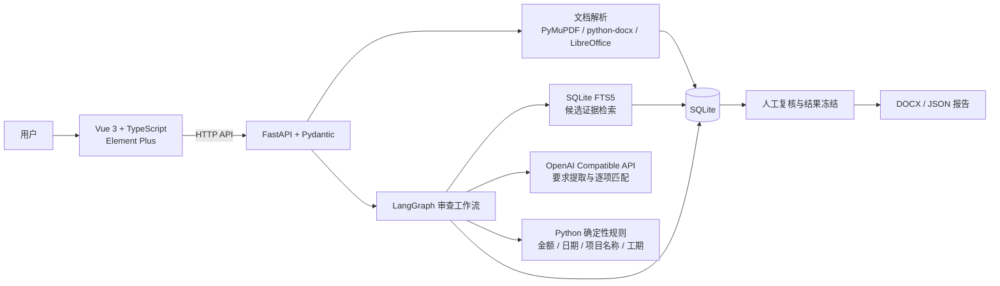
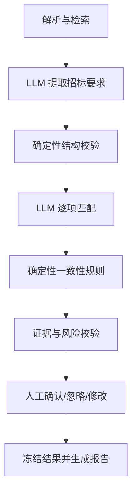
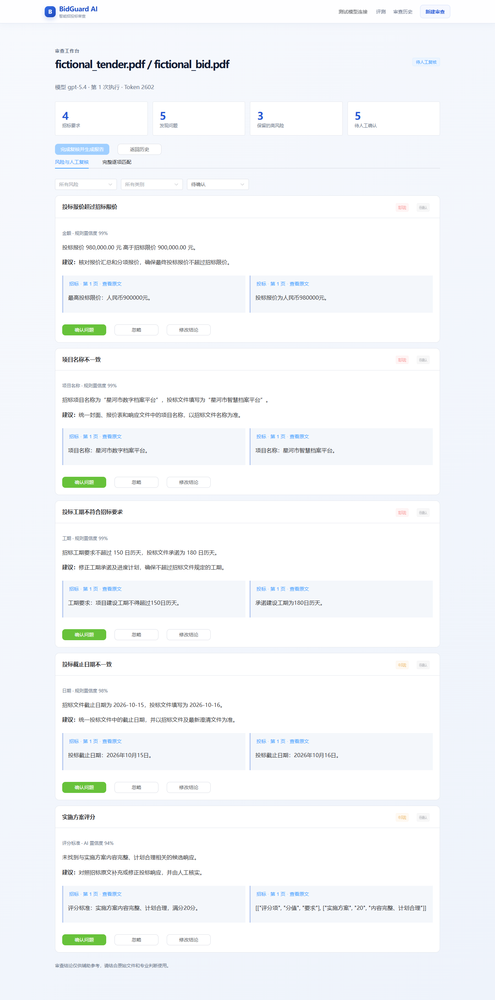
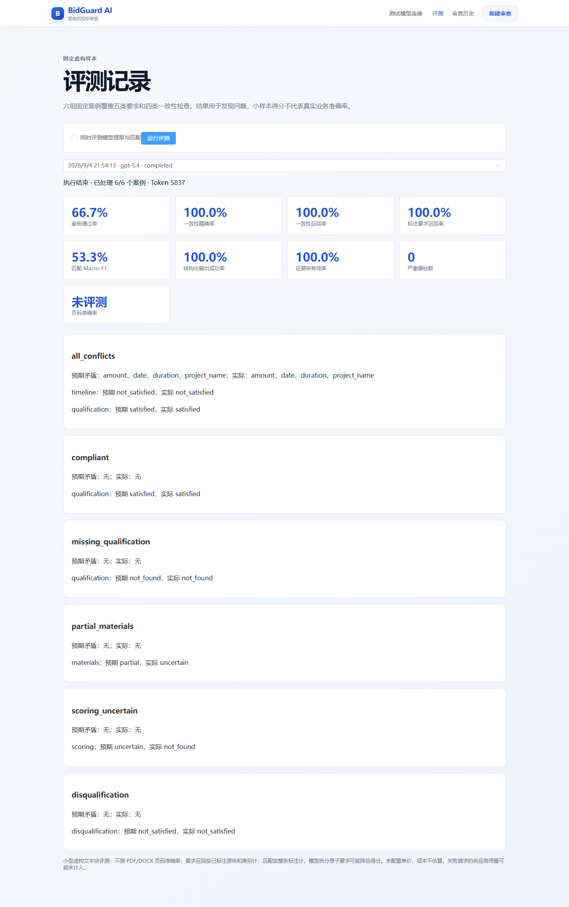

# BidGuard AI

招投标文件智能审查助手。项目使用 Vue 3、TypeScript、Vite、Element Plus、FastAPI、Pydantic、LangGraph 和 SQLite 构建，面向本地、单用户场景。

> 当前进度：已完成本地 MVP 闭环，包括文件解析、后台 LangGraph 审查、检查点重试、人工复核、冻结报告和固定样本评测。真实模型匹配质量仍有不足，详见评测结果。

## 功能范围

- 上传 DOCX 和文本型 PDF；拒绝扫描 PDF、加密 PDF 和不可信文件格式。
- 提取标题、段落、表格、标题路径和页码。
- 使用 SQLite FTS5 检索相关文档块及相邻上下文。
- 通过可替换的 OpenAI Compatible 接口分批提取五类招标要求，保存证据块、置信度、模型与 Token 用量。
- 使用确定性候选检索缩小投标证据范围，再由模型逐项输出满足、部分满足、不满足、未找到或待确认。
- 使用确定性规则检查投标报价是否超限，以及截止日期、项目名称和工期是否矛盾。
- 后台执行并展示阶段进度；服务中断后可从检查点重试。
- 根据确定性风险矩阵生成缺项问题；工作台支持风险/类别/状态筛选、原文证据查看和确认/忽略/修改。
- 所有待处理问题完成复核后冻结结果，下载 Word（DOCX）和 JSON 报告；冻结后禁止修改。
- 六组固定虚构评测案例，保存整体指标、严重漏检和逐案例失败原因。

## 技术架构



## 受控工作流



LangGraph 只负责编排固定节点、SQLite checkpoint 和人工暂停；模型不直接修改数据库或决定最终人工状态。FastAPI BackgroundTasks 执行后台任务，单个后端进程串行调用模型。仅支持单进程部署，不要使用多个 Uvicorn workers。

## 本地启动

环境要求：Node.js 20 或兼容版本、Python 3.11+。解析 DOCX 页码还需要安装 LibreOffice；仅使用文本 PDF 时可暂不安装。接口冒烟脚本使用 PowerShell 7。

```powershell
Copy-Item .env.example .env

python -m venv .venv
.\.venv\Scripts\Activate.ps1
pip install -r backend\requirements.txt
python scripts\create_samples.py
uvicorn backend.app.main:app --reload
```

另开终端启动前端：

```powershell
cd frontend
npm install
npm run dev
```

打开 `http://127.0.0.1:5173`。API 文档位于 `http://127.0.0.1:8000/docs`。

依赖安装完成后，也可在项目根目录运行 `powershell -ExecutionPolicy Bypass -File .\scripts\start-local.ps1 -OpenBrowser`，在后台启动前后端并打开页面。日志保存在 `data/logs/`，启动时会显示进程 PID；需要停止时可使用 `Stop-Process -Id <PID>`。修改 `.env` 后需停止并重新启动后端。

## 接口冒烟验证

先启动后端，再运行：

```powershell
.\scripts\smoke.ps1
.\scripts\check_public_repo.ps1
```

冒烟脚本执行健康检查、上传两份虚构 PDF、查询解析结果并验证 FTS5 命中。DOCX 页码验证要求本机已安装 LibreOffice。
需要同时验证模型审查和人工复核闭环时运行 `.\scripts\smoke.ps1 -WithModel`；该选项会产生多次真实模型调用，并对虚构样本自动确认发现、冻结报告。

无需 API 的检查点恢复、重复重试拒绝、人工修改和冻结报告验证：

```powershell
.\.venv\Scripts\python.exe scripts\verify_workflow.py
```

## 使用流程

1. 在“新建审查”选择招标和投标文件，点击“上传并解析”。
2. 确认外部模型处理提示，再开始 AI 审查。任务在后台运行，离开页面后可从审查历史继续查看。
3. 在工作台查看完整匹配清单和双侧证据，对问题逐条确认、忽略或修改。筛选状态可切换到全部，重新查看已处理项。
4. 待确认数为零后点击“完成复核并生成报告”，下载 DOCX/JSON。已完成审查不能修改，重新审查请创建新记录。
5. “评测”默认只检查规则；勾选模型评测并确认后会调用当前模型处理固定虚构样本。

服务中断时，遗留的排队/执行中任务会在下次启动标为失败，用户可从检查点重试。更换模型、端点或关键参数后应新建审查，避免混用不同配置。升级旧版数据库时自动迁移，并在 `data/bidguard.pre-workflow.bak` 留存首次迁移备份。

## 模型配置

当前默认示例为兼容 OpenAI Chat Completions 的 `jiniu.ai`，模型名为 `gpt-5.4`。复制 `.env.example` 为 `.env`，仅在本地填写 `MODEL_API_KEY`，然后调用 `POST /api/model/check` 验证连通性。若本机代理无法连接该平台，可设置 `MODEL_BYPASS_PROXY=true` 仅让模型请求直连。后续切换接口只需修改模型配置。

免费额度和可用模型可能随供应商政策变化，仓库不会内置、共享或代领 API Key。使用远程 API 时，候选文档片段会发送给对应服务；只有 Ollama 模式可视为完全本地处理。

Ollama 使用其 OpenAI Compatible `/v1` 接口，将 `MODEL_PROVIDER=ollama`、`MODEL_BASE_URL=http://127.0.0.1:11434/v1`、`MODEL_NAME` 设为本机已下载模型，API Key 可留空。当前调用串行执行；超时、429 和 5xx 最多重试两次，结构校验失败最多重试一次。超出批次上限的块会明确失败，请拆分文档或调整 `MODEL_BATCH_CHARS`，不会静默截断。

## 界面截图

### 审查工作台



### 质量评测



## 样本与评测

`samples/` 仅包含脚本生成的虚构数据，不代表真实公司或真实项目。

- [固定评测数据](evals/cases.jsonl) 与 [实际基线记录](evals/baseline-2026-09-04.json)。

2026-09-04 使用 `gpt-5.4`、temperature 0.7 的六组文本块评测：案例通过率 66.7%，一致性精确率/召回率 100%，标注要求召回率 100%，匹配 Macro-F1 53.3%，结构化输出与证据校验案例通过率均为 100%。匹配未达到方案中的 75% 目标。`partial_materials` 预期部分满足、实际聚合为不确定；`scoring_uncertain` 预期不确定、实际未找到。未隐藏失败案例。

这些结果仅针对小型虚构文本块集合，不代表真实业务准确率。要求召回按源块和类别计算，原子要求拆分与整条标注不一致会影响匹配评分；页码准确率未在该集合中评测，界面显示“未评测”。未配置供应商单价，成本留空；失败请求的供应商用量可能未计入。PDF/DOCX 解析由独立接口冒烟验证。

## 已知限制

- 当前是本地单用户 MVP，仅支持单个后端进程，不适用于多用户或高并发生产环境。
- 支持 DOCX 和文本型 PDF；暂不支持扫描件 OCR、加密 PDF 及复杂跨页表格的完整还原。
- 候选证据使用 SQLite FTS5 关键词检索，尚未加入向量检索与 rerank，同义表达可能漏召回。
- 固定评测集仅有六组虚构案例，不能代表真实招投标文件上的准确率；当前匹配 Macro-F1 为 53.3%，所有结论仍需人工复核。
- 使用远程模型时，候选文档片段会发送给所配置的模型服务；敏感文件应使用获准服务或本地 Ollama。
- 当前未提供用户体系、RBAC、对象存储、任务队列、容器化部署、监控告警及审计日志。

## 免责声明

BidGuard AI 仅用于辅助检查和软件工程演示，不构成法律、招标、投标、财务或合规专业意见。模型可能遗漏、误判或生成不准确内容，所有结论必须由具备相关专业能力的人员复核。请勿将未获授权的敏感文件发送给任何远程模型服务。

## License

[MIT](LICENSE)
