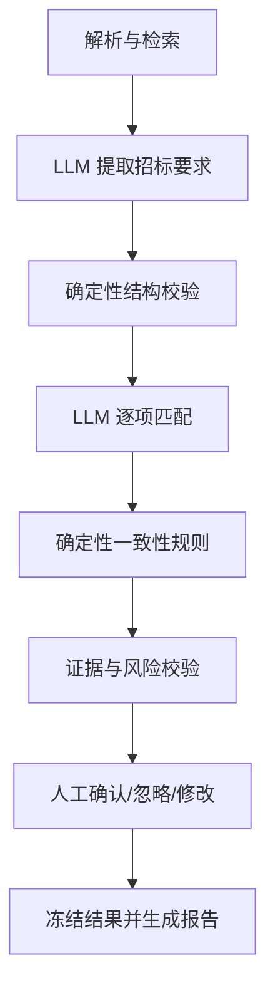

# BidGuard AI

招投标文件智能审查助手。项目使用 Vue 3、TypeScript、Vite、Element Plus、FastAPI、Pydantic、LangGraph 和 SQLite 构建，面向本地、单用户场景。

> 当前进度：文件解析、招标要求提取和投标响应逐项匹配已完成。跨文档矛盾规则及 LangGraph 工作流尚未接入。

## 功能范围

- 上传 DOCX 和文本型 PDF；拒绝扫描 PDF、加密 PDF 和不可信文件格式。
- 提取标题、段落、表格、标题路径和页码。
- 使用 SQLite FTS5 检索相关文档块及相邻上下文。
- 通过可替换的 OpenAI Compatible 接口分批提取五类招标要求，保存证据块、置信度、模型与 Token 用量。
- 使用确定性候选检索缩小投标证据范围，再由模型逐项输出满足、部分满足、不满足、未找到或待确认。
- 后续阶段将完成一致性检查、人工复核、报告和固定评测集。

不包含 OCR、多租户、Redis、Celery、微服务、云部署和无意义的多智能体包装。

## 技术架构

```text
Vue 3 + Element Plus
        │ HTTP
        ▼
FastAPI + Pydantic
        ├── DOCX：python-docx + LibreOffice 页码转换
        ├── PDF：PyMuPDF
        ├── OpenAI Compatible API：结构化要求提取
        └── SQLite + FTS5：文档、审查与要求
```

## 计划中的受控工作流



LangGraph 只负责编排固定节点、重试、checkpoint 和人工暂停；模型不直接修改数据库或决定最终人工状态。

## 本地启动

环境要求：Node.js 20、Python 3.11+。解析 DOCX 页码还需要安装 LibreOffice；仅使用文本 PDF 时可暂不安装。

```powershell
Copy-Item .env.example .env

python -m venv .venv
.\.venv\Scripts\Activate.ps1
pip install -r backend\requirements.txt
python scripts\create_samples.py
uvicorn backend.app.main:app --reload
```

另开终端启动前端：

```powershell
cd frontend
npm install
npm run dev
```

打开 `http://127.0.0.1:5173`。API 文档位于 `http://127.0.0.1:8000/docs`。

## 接口冒烟验证

先启动后端，再运行：

```powershell
.\scripts\smoke.ps1
.\scripts\check_public_repo.ps1
```

冒烟脚本执行健康检查、上传两份虚构 PDF、查询解析结果并验证 FTS5 命中。DOCX 页码验证要求本机已安装 LibreOffice。
需要同时验证付费模型要求提取时运行 `.\scripts\smoke.ps1 -WithModel`；该选项会产生一次真实模型调用。

## 模型配置

当前默认示例为兼容 OpenAI Chat Completions 的 `jiniu.ai`，模型名为 `gpt-5.4`。复制 `.env.example` 为 `.env`，仅在本地填写 `MODEL_API_KEY`，然后调用 `POST /api/model/check` 验证连通性。若本机代理无法连接该平台，可设置 `MODEL_BYPASS_PROXY=true` 仅让模型请求直连。后续切换接口只需修改模型配置。

免费额度和可用模型可能随供应商政策变化，仓库不会内置、共享或代领 API Key。使用远程 API 时，候选文档片段会发送给对应服务；只有 Ollama 模式可视为完全本地处理。

## 样本、截图与评测

`samples/` 仅包含脚本生成的虚构数据，不代表真实公司或真实项目。

- 截图：将在人工复核页面完成后补充，不使用伪造截图。
- 评测结果：将在固定评测集和模型工作流完成后补充，如实展示失败案例。

## 免责声明

BidGuard AI 仅用于辅助检查和软件工程演示，不构成法律、招标、投标、财务或合规专业意见。模型可能遗漏、误判或生成不准确内容，所有结论必须由具备相关专业能力的人员复核。请勿将未获授权的敏感文件发送给任何远程模型服务。

## License

[MIT](LICENSE)
